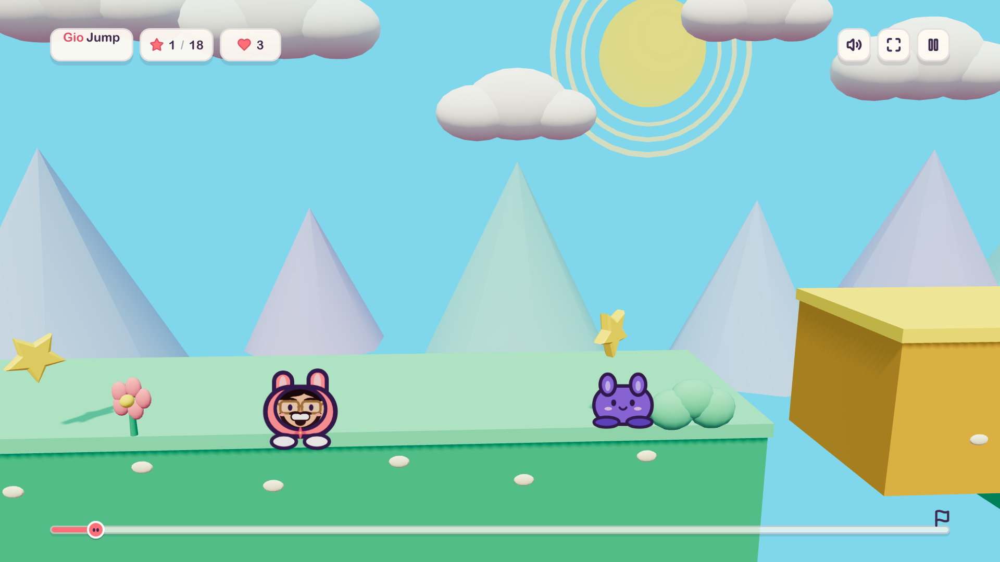

# Gio Jump

Gio Jump is a colorful side-scrolling platform game built with Three.js for the
web, Fire OS, and Amazon Vega OS. Guide Gio across Cloudberry Kingdom, collect
stars, activate checkpoints, avoid enemies, and reach the finish flag.



## Features

- Play a complete platforming course with 18 collectibles and two checkpoints.
- Use keyboard, gamepad, or Fire TV remote controls.
- Run the same game in a browser, an Android WebView, or a Vega WebView.
- Buy and restore the non-consumable Aurora Skin through OpenIAP on Android TV,
  Fire OS, and Vega.
- Scale rendering automatically for lower-power Android, Fire TV, and Vega devices.
- Preserve responsive layouts across television, desktop, and mobile screens.
- Generate music and sound effects with the Web Audio API.

## Get started

### Prerequisites

Install the following tools:

| Tool | Requirement |
| --- | --- |
| Node.js | 20 or later |
| npm | 10 or later |
| Browser | WebGL-capable browser |

To build the Android app, also install:

| Tool | Requirement |
| --- | --- |
| JDK | 17 |
| Android SDK | API level 36 |
| ADB | Required to deploy to a Fire TV device |

The repository includes the Gradle wrapper. You don't need to install Gradle
separately.

To build the Vega app, install the current Vega Developer Tools on a supported
macOS or Ubuntu host. Gio Jump targets Vega SDK 0.24 and Vega OS 1.2. The Vega
toolchain requires about 20 GB of free disk space; Windows and WSL aren't
supported by Amazon.

### Run the web game

1. Install the dependencies:

   ```bash
   npm ci
   ```

2. Start the development server:

   ```bash
   npm run dev
   ```

3. Open the URL shown by Vite. The default local URL is
   `http://localhost:5173`.

### Create a production build

Run:

```bash
npm run build
```

Vite writes the optimized web bundle to `dist/`.

## Controls

| Action | Keyboard or remote | Gamepad |
| --- | --- | --- |
| Move | Left or Right arrow | Left stick or D-pad |
| Jump | Up arrow, Enter, or Space | D-pad Up or primary button |
| Fast fall | Down arrow | D-pad Down |
| Pause | Escape or media Play/Pause | Start |
| Select menu item | Enter or Space | Primary button |
| Go back | Escape or Back | Secondary button |

The game is designed so you can complete the course with a Fire TV directional
remote.

## Build the Android app

The Android application packages the production web bundle in a
hardware-accelerated `WebView`.

1. Set `ANDROID_HOME` to your Android SDK directory.

2. Build the Google Play debug APK for Android TV:

   ```bash
   npm run android:apk:play
   ```

3. Find the APK at:

   ```text
   android/app/build/outputs/apk/play/debug/app-play-debug.apk
   ```

The default `npm run android:apk` command is an alias for the Play variant. Both
Android variants first run Vite and copy `dist/` into the Android assets.

## Deploy to Fire TV

1. Enable developer options and ADB debugging on the Fire TV.

2. Confirm that ADB can see the device:

   ```bash
   adb devices
   ```

3. Build and install the Amazon Appstore variant:

   ```bash
   npm run android:apk:amazon
   adb -s <device-serial> install -r \
     android/app/build/outputs/apk/amazon/debug/app-amazon-debug.apk
   ```

4. Launch Gio Jump:

   ```bash
   adb -s <device-serial> shell am start \
    -n com.giojump.tv.debug/com.giojump.tv.MainActivity
   ```

## Build the Vega app

Vega OS doesn't run Android APKs. The `vega/` project packages the same
production web game in Amazon's React Native for Vega 0.83 WebView and produces
a `.vpkg`.

1. Install or activate Vega SDK 0.24, then source the environment created by
   Vega Developer Tools:

   ```bash
   source ~/vega/env
   ~/vega/bin/vega sdk install main@0.24.9914 --non-interactive
   ~/vega/bin/vega sdk use main@0.24.9914
   source ~/vega/env
   ```

2. Install the Vega wrapper dependencies:

   ```bash
   npm run vega:install
   ```

3. Validate its dependency and OS compatibility:

   ```bash
   npm run vega:doctor
   ```

4. Build the release VPKGs:

   ```bash
   npm run vega:build
   ```

The build first writes Vite's relative production assets to
`vega/assets/game/`, then produces architecture-specific packages under
`vega/build/`. Use `armv7` on a physical Vega Fire TV, `aarch64` on Apple
Silicon's Vega Virtual Device, and `x86_64` on an Intel/Ubuntu x86_64 virtual
device. Before publishing an update, increase both `--build-version` and
`--build-number` in `vega/package.json`; Vega requires every submitted build
number to be greater than the previous one.

### Run on the Vega Virtual Device

Start the virtual device and launch the matching package:

```bash
~/vega/bin/vega virtual-device start --timeout 120
npm run vega:run
```

The virtual remote maps Select to Enter, the directional pad to the arrow keys,
Back to Escape, and Play/Pause to F4.

### Run on a Vega Fire TV

Enable Developer Mode on the device, connect it with Vega Device Adapter, then
build and launch the armv7 package:

```bash
~/vega/bin/vega device list
npm run vega:build
npm run vega:run -- --device <device-serial>
```

SDK 0.24 requires the Fire TV to run Vega OS 1.2. Check for device updates
before sideloading. A physical-device pass is required before Appstore
submission because current Vega Fire TV hardware has substantially less memory
than a desktop virtual device.

## Configure the Aurora Skin purchase

Create the same non-consumable product ID in Google Play and both Amazon app
catalogs before testing a real purchase. The exact catalog fields, store testing
requirements, APK variants, entitlement behavior, and server-verification option
are documented in [docs/iap-setup.md](docs/iap-setup.md).

## Test the game

Run the unit tests:

```bash
npm test
```

Install the Playwright browser once, then run the end-to-end tests:

```bash
npx playwright install chromium
npm run test:e2e
```

The end-to-end suite verifies WebGL rendering, keyboard and Fire/Vega remote
navigation, Vega's balanced rendering profile and native exit bridge,
responsive television layouts, mobile fallback behavior, and full course
completion.

## Project structure

| Path | Purpose |
| --- | --- |
| `src/game.js` | Three.js scene, game loop, collisions, camera, and effects |
| `src/level.js` | Platforms, collectibles, enemies, and checkpoints |
| `src/input.js` | Keyboard, remote, and gamepad input mapping |
| `src/audio.js` | Web Audio music and sound effects |
| `src/textures.js` | Procedurally generated character textures |
| `src/purchases.js` | Shared OpenIAP lifecycle and Aurora entitlement state |
| `src/main.js` | UI state and game integration |
| `android/` | Google Play and Amazon OpenIAP WebView wrappers |
| `vega/` | React Native for Vega WebView and OpenIAP wrapper |
| `docs/iap-setup.md` | Store catalog and purchase testing setup |
| `docs/vega-research.md` | Vega architecture, API, and device research |
| `tests/unit/` | Unit tests for input and level helpers |
| `tests/e2e/` | Playwright gameplay and visual smoke tests |

## Performance

Gio Jump uses a fixed 60 Hz simulation and an adaptive renderer. The renderer
uses a balanced profile on Android, Fire TV, and Vega, lowers render resolution
when frame time exceeds the target, batches particle effects, and limits menu
rendering to reduce idle GPU use.

Force a renderer profile during browser testing:

```text
http://localhost:5173/?quality=high
http://localhost:5173/?quality=low
```

## Troubleshooting

### The browser shows a WebGL error

Enable hardware acceleration in the browser and confirm that the device
supports WebGL 2.

### ADB doesn't list the Fire TV

Confirm that ADB debugging is enabled, accept the authorization prompt on the
television, and reconnect with `adb connect <device-ip>` when using network
debugging.

### Gradle uses the wrong Java version

Run `java -version` and verify that the active JDK is version 17.

### Android changes don't appear

Run `npm run android:apk` again. This command refreshes the generated WebView
assets before Gradle packages the APK.

### The Vega app shows old web assets

Run `npm run vega:build` again. Vega Fast Refresh doesn't update files packaged
under `vega/assets/`; the VPKG must be rebuilt and reinstalled.

### The Vega build reports a missing OS version

Confirm that SDK 0.24 is active with `vega --version`. The checked-in manifest
targets Vega OS 1.2, which is required by SDK 0.24.
